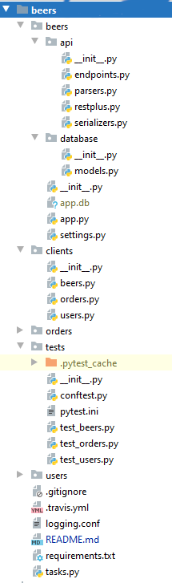
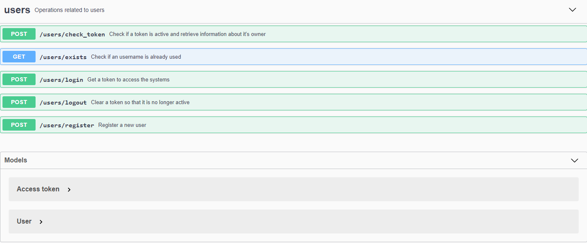
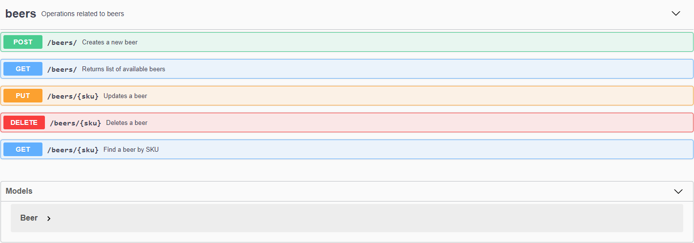
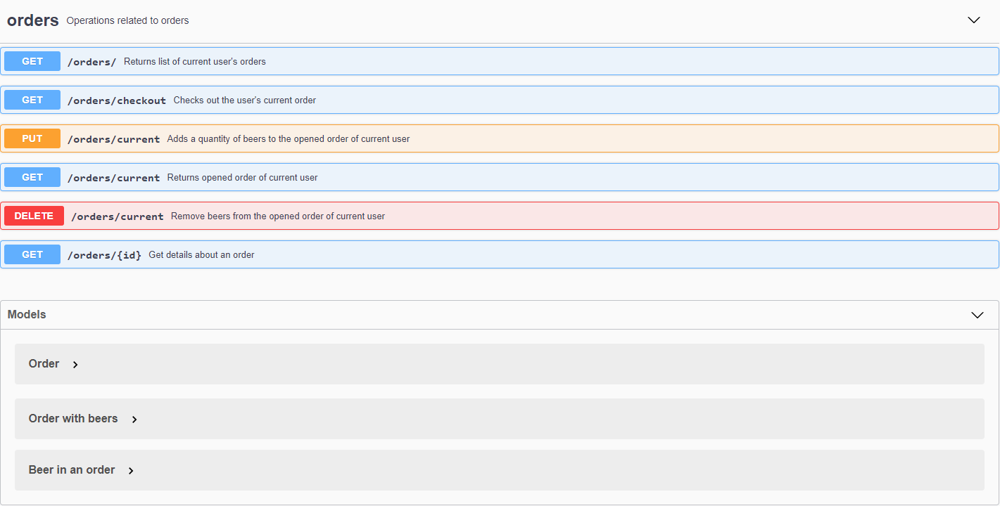

# Users, orders and beers microservices

### Micro services


There is no single definition for microservices. A consensus view has evolved over time in the industry. Some of the defining characteristics that are frequently cited include:

* Services in a microservice architecture (MSA) are often processes that communicate over a network to fulfill a goal using technology-agnostic protocols such as HTTP.
* Services in a microservice architecture are independently deployable.
* Services are organized around business capabilities.
* Services can be implemented using different programming languages, databases, hardware and software environment, depending on what fits best.
* Services are small in size, messaging-enabled, bounded by contexts, autonomously developed, independently deployable, decentralized and built and released with automated processes.

A microservice is not a layer within a monolithic application (example, the web controller, or the backend-for-frontend). Rather it is a self-contained piece of business functionality with clear interfaces, and may, through its own internal components, implement a layered architecture. From a strategy perspective, microservices architecture essentially follows the Unix philosophy of "Do one thing and do it well".[9] Martin Fowler describes a microservices-based architecture as having the following properties:[2]

* Lends itself to a continuous delivery software development process. A change to a small part of the application only requires rebuilding and redeploying only one or a small number of services.
* Adheres to principles such as fine-grained interfaces (to independently deployable services), business-driven development (e.g. domain-driven design).

It is common for microservices architectures to be adopted for cloud-native applications, serverless computing, and applications using lightweight container deployment. According to Fowler, because of the large number (when compared to monolithic application implementations) of services, decentralized continuous delivery and DevOps with holistic service monitoring are necessary to effectively develop, maintain, and operate such applications.[12] A consequence of (and rationale for) following this approach is that the individual microservices can be individually scaled. In the monolithic approach, an application supporting three functions would have to be scaled in its entirety even if only one of these functions had a resource constraint.[13] With microservices, only the microservice supporting the function with resource constraints needs to be scaled out, thus providing resource and cost optimization benefits.

### Models
#### User

```python
class User(db.Model):
    id = db.Column(db.Integer, primary_key=True)
    username = db.Column(db.String(255), unique=True, nullable=False)
    email = db.Column(db.String(255), unique=True, nullable=False)
    first_name = db.Column(db.String(255), unique=False, nullable=True)
    last_name = db.Column(db.String(255), unique=False, nullable=True)
    password = db.Column(db.String(255), unique=False, nullable=True)
    token = db.Column(db.String(255), unique=True, nullable=True)
    time_registered = db.Column(db.DateTime, default=datetime.utcnow)
    time_modified = db.Column(db.DateTime, onupdate=datetime.utcnow)
```

#### Order
```python
class Order(db.Model):
    id = db.Column(db.Integer, primary_key=True)
    owner_id = db.Column(db.Integer)
    beers = db.relationship('OrderBeer', backref='order')
    is_open = db.Column(db.Boolean, default=True)
    time_created = db.Column(db.DateTime, default=datetime.utcnow)
    time_modified = db.Column(db.DateTime, onupdate=datetime.utcnow)

```
#### Beer
```python
class Beer(db.Model):
    id = db.Column(db.Integer, primary_key=True)
    name = db.Column(db.String(255), nullable=False)
    sku = db.Column(db.String(255), unique=True, nullable=False)
    price = db.Column(db.DECIMAL(precision=8, scale=2), nullable=False)
    image = db.Column(db.String(255), unique=False, nullable=True)
    time_created = db.Column(db.DateTime, default=datetime.utcnow)
    time_modified = db.Column(db.DateTime, onupdate=datetime.utcnow)
```

### Project structure



### Environment variables
* FLASK_SERVER_NAME - domain name:port of the server
* SECRET_KEY - Flask security value
* DATABASE_URL - database configuration string

### Configuration
If you want you can create a virtual environment and activate it.

Install required python modules:
```bash
pip install -r requirements.txt
```

Prepare users' database:
```bash
inv users setup
python -m inv users setup
```

Prepare beers' database:
```bash
inv beers setup
```

Prepare orders' database:
```bash
inv orders setup    
```

### Test micro services
```bash
pytest tests
```

### Start micro services
To start users' endpoints run (default at localhost:5001): 
```bash
python -m inv users serve
```

To start beers' endpoints run (default at localhost:5002):
```bash
inv beers serve
```

To start orders' endpoints run (default at localhost:5003):
```bash
inv orders setup
```

## Micro services interfaces
### Users interface



### Beers interface



### Orders interface



